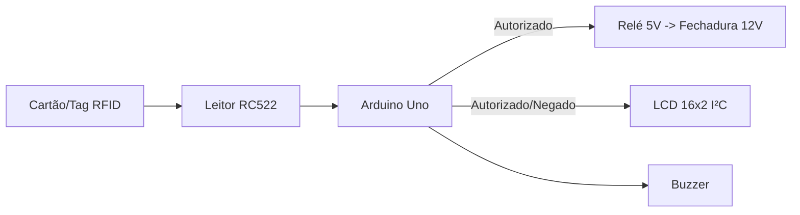

 Controle de Acesso RFID – Arduino

Sistema de **controle de acesso** com **Arduino Uno**, **leitor RFID RC522**, **LCD 16x2 (I²C)**, **buzzer** e **relé** para acionar uma **fechadura elétrica**.
Funciona com **lista de UIDs autorizados (whitelist)**, **feedback no LCD/buzzer** e **pulso de 3s** no relé usando **máquina de estados com `millis()`** (sem `delay()`).

## 🎥 Demo

> Aproxime um cartão/tag. Se estiver autorizado: **beep agudo + “Bem-vindo” + relé por 3s**. Caso contrário: **beep grave + “ACESSO NEGADO”**.

## ⚙️ Funcionalidades

* Leitura RFID (RC522 via SPI).
* **Whitelist** de UIDs com nome do usuário.
* Feedback **não-bloqueante** (LCD + buzzer).
* Relé controlado por **pulso temporizado** (3s por padrão).
* **Antirepetição (cooldown)** para evitar leituras duplicadas.

---

## 🧰 Materiais

* Arduino **Uno R3**
* Módulo **RFID RC522** + cartão/chaveiro
* **LCD 16x2 I²C** (ex.: endereço `0x27`)
* **Módulo Relé 5V** (contato seco)
* **Buzzer** 5V
* **Fechadura elétrica 12V** + fonte 12V
* Jumpers e protoboard

---

## 🧪 Fluxo do sistema



---

## 🔌 Ligações (Arduino UNO)

**RC522 (3.3V!)**

| RC522  | Arduino |
| ------ | ------- |
| SDA/SS | D10     |
| SCK    | D13     |
| MOSI   | D11     |
| MISO   | D12     |
| RST    | D9      |
| 3.3V   | 3.3V    |
| GND    | GND     |

**LCD 16x2 I²C**

| LCD | Arduino |
| --- | ------- |
| VCC | 5V      |
| GND | GND     |
| SDA | A4      |
| SCL | A5      |

**Outros**

| Dispositivo  | Arduino  |
| ------------ | -------- |
| Relé IN      | D8       |
| Relé VCC/GND | 5V / GND |
| Buzzer +     | D5       |
| Buzzer −     | GND      |

**Fechadura 12V:** fonte 12V(+) → **COM** do relé; **NO** do relé → fechadura(+) ; fechadura(−) → fonte 12V(−).

> ⚠️ **Atenção:** o **RC522 é 3.3V**. Não alimente em 5V.
> Alguns módulos de relé são **ativo-LOW** (o código já trata isso).

---

## 🚀 Como rodar

1. Abra `projeto_fechadura.ino` na IDE Arduino.
2. Selecione **Board: Arduino Uno** e a **porta** correta.
3. Faça as ligações acima.
4. **Upload** do sketch.
5. Abra o **Serial Monitor** (9600) para visualizar logs.

---

## 👥 Cadastrando novos cartões (whitelist)

No início do código existe o vetor `AUTH[]`:

```cpp
struct User { byte len; byte b[10]; const char* name; };
const User AUTH[] = {
  {4, {0x63,0x2B,0x31,0xE2}, "Gabriel"},
  // {4, {0xDE,0xAD,0xBE,0xEF}, "Outro Usuario"},
};
```

Para descobrir o UID:

* Habilite um `Serial.println()` do UID (ou use um sketch de leitura de UID), aproxime o cartão e copie os bytes em **HEX**.
* Adicione uma nova linha no `AUTH[]` com o nome desejado.

---

## 🛠️ Ajustes rápidos

* **Tempo da fechadura:**
  `const unsigned long DOOR_PULSE_MS = 3000; // 3 s`
* **Relé ativo em LOW/HIGH:**
  `const bool RELAY_ACTIVE_LOW = true;`
* **Filtro de leituras repetidas:**
  `const unsigned long COOLDOWN_MS = 300;`
* **Endereço do LCD:** troque `LiquidCrystal_I2C lcd(0x27, 16, 2);` para `0x3F` se necessário.

---

## 🧯 Solução de problemas

* **RC522 não lê:** confira **3.3V**, fios **SPI** (D10–D13–D11–D12–D9) e **GND** comum.
* **LCD “quadradinho”/lixo:** verifique o **endereço I²C** (`0x27`/`0x3F`) e a alimentação 5V.
* **Relé invertido/não aciona:** ajuste `RELAY_ACTIVE_LOW` e cheque VCC/GND do módulo.
* **Fechadura não abre:** confirme a **fonte 12V**, o **contato NO/COM** e a polaridade.
* **Buzzer alto:** reduza a duração no `tone()` (por ex. 120 ms).

---

## 📂 Estrutura do repositório

```
/projeto_fechadura.ino     # firmware Arduino
/CONTROLE DE ACESSO RFID.pdf  # slides/relatório do projeto
```

---

## 📜 Licença

Defina uma licença (ex.: **MIT**) em `LICENSE` para permitir uso e contribuições.

---

## 🤝 Créditos

Projeto desenvolvido para apresentação de **Sistemas Embarcados**.
Hardware: Arduino Uno, RC522, LCD I²C, relé 5V, buzzer, fechadura 12V.
